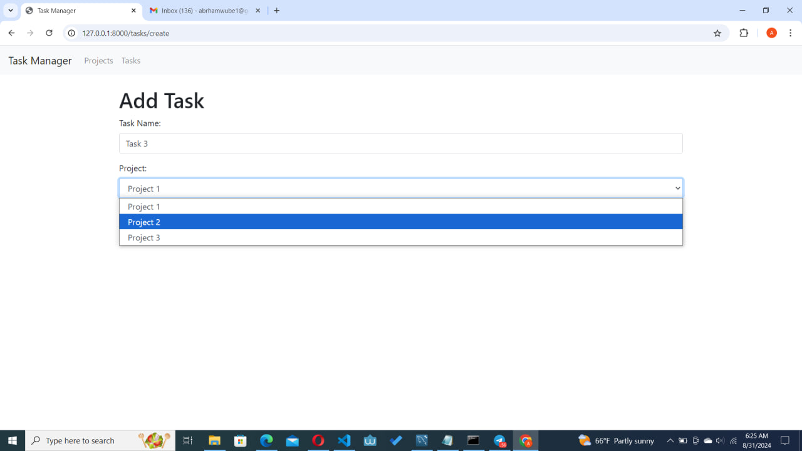

# 🚀 Laravel Task Management Application

A simple task management application built with Laravel. This application allows users to create, edit, delete, and reorder tasks with drag-and-drop functionality. Tasks are associated with projects, and the user can filter tasks by selecting a project. The application uses MySQL as the database.

## 📑 Table of Contents

- [Features](#-features)
- [Screenshots](#-screenshots)
- [Prerequisites](#-prerequisites)
- [Installation](#-installation)
  - [Option 1: Cloning the Repository](#option-1-cloning-the-repository)
  - [Option 2: Downloading the Zip File](#option-2-downloading-the-zip-file)
- [Configuration](#-configuration)
- [Database Setup](#-database-setup)
- [Running the Application](#-running-the-application)
- [Usage](#-usage)

## ✨ Features

- ✅ Create, edit, delete tasks
- 🔄 Reorder tasks with drag-and-drop functionality
- 🏷️ Assign tasks to specific projects
- 🔍 Filter tasks by project
- 📱 Responsive and user-friendly UI

## 📸 Screenshots

Here are some screenshots of the application in action:

### Projects Overview


### Tasks List


### Create Project


### Edit Project


### Create Task


### Edit Task


a

## 🛠️ Prerequisites

Before you begin, ensure you have met the following requirements:

- PHP >= 8.0
- Composer
- MySQL
- Node.js & npm (for managing frontend dependencies)

## 📦 Installation

You have two options for installing the project: cloning the repository or downloading the zip file.

### Option 1: Cloning the Repository

1. **Clone the Repository**
   ```bash
   git clone https://github.com/abrshewube/task-manager
   cd task-manager
   ```

2. **Install Dependencies**
   Install PHP dependencies via Composer:
   ```bash
   composer install
   ```
   Install frontend dependencies via npm:
   ```bash
   npm install
   ```

### Option 2: Downloading the Zip File

1. **Download the Zip File**
  
2. **Extract the Zip File**
   Extract the downloaded zip file to your desired location.

3. **Navigate to the Project Directory**
   Open a terminal and navigate to the extracted project directory.

4. **Install Dependencies**
   Install PHP dependencies via Composer:
   ```bash
   composer install
   ```
   Install frontend dependencies via npm:
   ```bash
   npm install
   ```

## ⚙️ Configuration


1. **Generate Application Key**
   ```bash
   php artisan key:generate
   ```

3. **Configure Environment Variables**
   Update the following in your `.env` file:
   ```plaintext
   APP_NAME=TaskManager
   APP_URL=http://localhost:8000
   DB_CONNECTION=mysql
   DB_HOST=127.0.0.1
   DB_PORT=3306
   DB_DATABASE=your_database_name
   DB_USERNAME=your_database_username
   DB_PASSWORD=your_database_password
   ```

## 🗄️ Database Setup

1. **Create the Database**
   Create a new MySQL database:
   ```sql
   CREATE DATABASE your_database_name;
   ```

2. **Run Migrations**
   Run the database migrations to create the necessary tables:
   ```bash
   php artisan migrate
   ```

3. **Run Seeders (Optional)**
   Populate the database with sample data (if you have seeders):
   ```bash
   php artisan db:seed
   ```

## 🚀 Running the Application

1. **Compile Assets**
   Compile the frontend assets:
   ```bash
   npm run dev
   ```

2. **Start the Development Server**
   Start the Laravel development server:
   ```bash
   php artisan serve
   ```

3. **Access the Application**
   Open your browser and navigate to:
   ```plaintext
   http://localhost:8000
   ```

## 📝 Usage

### Adding a New Task
- Navigate to the task list page
- Click on the "Add New Task" button
- Fill in the task details and select a project
- Save the task

### Editing a Task
- On the task list page, click on the "Edit" button next to a task
- Modify the task details
- Save the changes

### Deleting a Task
- On the task list page, click on the "Delete" button next to a task
- Confirm the deletion

### Reordering Tasks
- Drag and drop tasks to reorder them on the task list page
- The priority will automatically update based on the new order

### Filtering by Project
- Use the dropdown at the top of the task list page to filter tasks by a specific project

---

Made with ❤️ by Abrham Wube